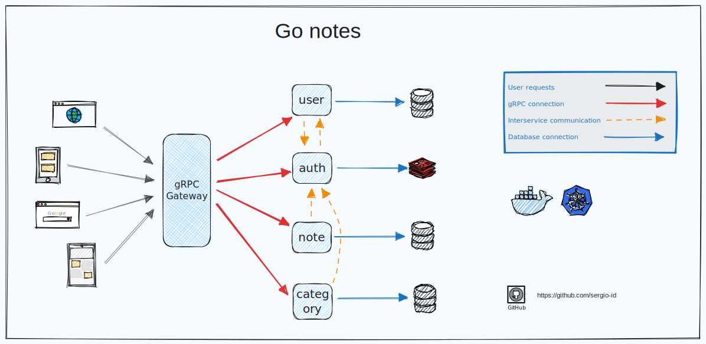
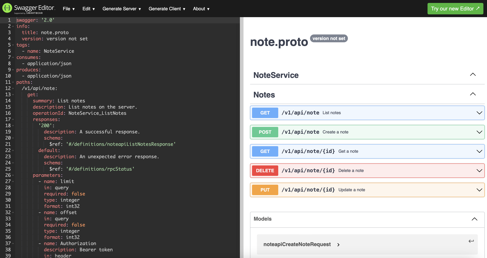

# Go Notes example

### Tech stack:

* [GRPC Gateway](https://github.com/grpc-ecosystem/grpc-gateway) - gRPC Gateway
* [GRPC](https://grpc.io/) - gRPC
* [Protobuf](https://developers.google.com/protocol-buffers) - Protobuf
* [Wire](https://github.com/google/wire) - Automated Initialization in Go
* [SQLC](https://github.com/kyleconroy/sqlc) - A SQL Compiler
* [Go-redis](https://github.com/go-redis/redis) - Redis client for Golang
* [Zap](https://github.com/uber-go/zap) - Logger
---

* [Docker](https://www.docker.com/) - Docker
* [Docer Compose](https://docs.docker.com/compose/) - Docker Compose
* [Helm](https://helm.sh/) - Helm
* [k8s](https://kubernetes.io/) - k8s
* [GitHub Actions](https://github.com/features/actions) - GitHub Actions (_for lint and unit tests_)
---

* [Postman Collection](https://www.postman.com/) - Postman Collection (_third_party/PostmanCollection_)
* [OpenAPI](https://swagger.io/specification/) - OpenAPI (_third_party/OpenAPI_)
---

* [Excalidraw](https://excalidraw.com) - Excalidraw for diagrams



---

### Usage local:

```bash
make docker-up   // run all containers with application
```

The service is available at http://localhost:5555/v1/api. You can check it using Postman by importing the collection
located at `third_party/PostmanCollection/Notes.postman_collection.json`.

### Stop containers:

```bash
make docker-down      // stop containers
```

---

### TESTS

### 1. Postman

To import a collection into Postman, you should use the `Import` button in the top-left corner of the Postman window.

Before running the tests, it's necessary to set the required environment variables:

`baseUrl`: the address of the server where the project is running.

Example: `http://localhost:5555/v1/api`

To run the tests in Postman, you should select the collection (`Notes -> Tests`), and then click the
button (`Run folder -> Run Notes`).

The passed tests will appear as follows:


---

### Unit tests

```bash
make test-run   // run unit tests
```

---

## k8s

To deploy the project in Kubernetes (k8s), Helm is used.

```bash
cd .charts/go-notes/proxy && \
helm dependency update && \
helm install -f values.yaml go-notes .
```

---

### Checking the Swagger documentation:

Take the generated file `{{service}}.swagger.json` from the `third_party/OpenAPI` directory.
Paste it into the [Swagger Editor](https://editor.swagger.io).


